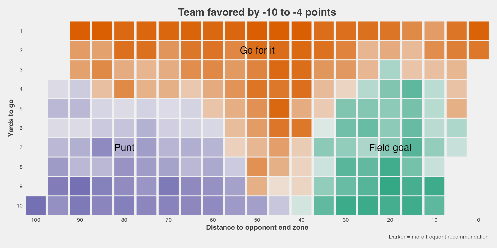
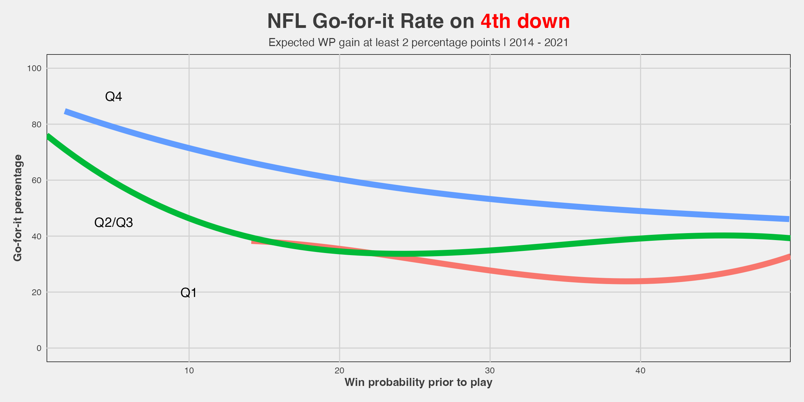

# 4th down research

## Four basic examples of doing something with `nfl4th`

We begin by demonstrating the use of `nfl4th` to load all seasons for
which 4th down calculations are available in one line of code.

``` r
pbp <- nfl4th::load_4th_pbp(2014:2022, fast = T) |>
  filter(down == 4)
```

The key columns generated by the main `nfl4th` function,
[`load_4th_pbp()`](https://www.nfl4th.com/reference/load_4th_pbp.md),
are `go_boost`, which gives the predicted gain (or loss, when negative)
in win probability associated with going for it, relative to the
next-best alternative (whether kicking a field goal or punting), and
`go`, which is an indicator for whether the team went for it on a given
play. Note that `go_boost` and `go` are measured in percentage points
(i.e., 0 to 100) in order to make creating figures like the following
easier. This means that the values for `go` are either `0` or `100` in
every row.

### Rate of going for it versus predicted benefit

Let’s make a plot that shows that teams’ likelihood of going for it in
2020 versus how large the predicted benefit would be.

``` r
pbp |>
  dplyr::filter(season == 2020) |>
  dplyr::mutate(go_boost = DescTools::RoundTo(go_boost, 0.5)) |>
  dplyr::group_by(go_boost) |>
  dplyr::summarize(go = mean(go)) |>
  dplyr::ungroup() |>
  dplyr::filter(between(go_boost, -10, 10)) |>
  dplyr::mutate(
    should_go = dplyr::case_when(
      go_boost > .5 ~ 1,
      go_boost < -.5 ~ 0,
      TRUE ~ 2)
  ) |>
  ggplot(aes(go_boost, go, color = as.factor(should_go))) + 
  geom_point(size = 5, color = "black", alpha = .5) +
  geom_vline(xintercept = 0) +
  geom_smooth(method = "lm", show.legend = F, se = F, size = 3)+
  theme_ben +
  labs(x = "Gain in win probability by going for it (nfl4th)",
       y = "Go-for-it percentage",
       title = glue::glue("NFL Go-for-it Rate on <span style='color:red'>4th down</span>")
       ) +
  scale_y_continuous(breaks = scales::pretty_breaks(n = 10), expand = c(0,2)) +
  scale_x_continuous(breaks = scales::pretty_breaks(n = 20), limits = c(-10, 10), expand = c(0,0)) +
  annotate("text",x=-4, y= 90, label = "Should\nkick", color="red", size = 5) +
  annotate("text",x=3, y= 90, label = "Should\ngo for it", color="red", size = 5) +
  annotate("label",x=-6, y= 15, label = "Teams almost always kick\nwhen they should...", size = 5) +
  annotate("label",x=6, y= 25, label = "...but frequently\n kick when they\nshould go for it", size = 5)
#> Warning: Using `size` aesthetic for lines was deprecated in ggplot2 3.4.0.
#> ℹ Please use `linewidth` instead.
#> This warning is displayed once per session.
#> Call `lifecycle::last_lifecycle_warnings()` to see where this warning was
#> generated.
#> Warning: Removed 11 rows containing non-finite outside the scale range
#> (`stat_smooth()`).
#> Warning: Removed 11 rows containing missing values or values outside the scale range
#> (`geom_point()`).
```


### Check coaches’ alignment with the model

Here’s how to create one of the tables shown in [the piece on The
Athletic](https://theathletic.com/2144214/2020/10/28/nfl-fourth-down-decisions-the-math-behind-the-leagues-new-aggressiveness/):

``` r
pbp |>
  dplyr::filter(season == 2020, !is.na(go_boost), !is.na(go)) |>
  dplyr::mutate(type = dplyr::case_when(
    go_boost >= 4 ~ "Definitely go for it",
    go_boost > 1 & go_boost < 4 ~ "Probably go for it",
    go_boost >= -1 & go_boost <= 1 ~ "Toss-up",
    go_boost < -1 & go_boost > -4 ~ "Probably kick",
    go_boost <= -4 ~ "Definitely kick"
  )) |>
  dplyr::group_by(type) |>
  dplyr::summarize(go = mean(go), n = dplyr::n()) |>
  dplyr::ungroup() |>
  dplyr::arrange(-go) |>
  gt::gt() |>
  gt::cols_label(
    type = "Recommendation",
    go = "Went for it %",
    n = "Plays"
  ) |>
  gt::tab_style(
    style = gt::cell_text(color = "black", weight = "bold"),
    locations = list(
      gt::cells_column_labels(dplyr::everything())
    )
  ) |> 
  add_gt_options() |>
  gt::fmt_number(columns = dplyr::vars(go), decimals = 0) |>
  gt::cols_align(
    columns = 2:3, align = "center"
  ) |> 
  gt::tab_header(title = "NFL team decision-making by go recommendation, 2020") |>
  gt::tab_source_note(gt::md('**Notes**: "Definitely" recommendations are greater than 4 percentage point advantage,<br> "probably" 1-4 percentage points'))
```

[TABLE]

Thus, we can see that the model is strongly aligned to what coaches do.

### Worst kick decisions of 2020

Here are the worst instances of not going for it (and instead punting or
kicking a field goal) in terms of total expected win probability lost.

2020’s champion is Kliff Kingsbury.

``` r
pbp |>
  filter(
    season == 2020,
    go == 0,
    # they tried to go for it so throw this play out
    !(posteam == "ARI" & week == 3 & play_id == 2364)
  ) |>
  arrange(-go_boost) |>
  mutate(rank = 1 : n()) |>
  head(10) |>
  select(rank, posteam, defteam, week, qtr, ydstogo, score_differential, go_boost, desc) |>
  gt() |>
  cols_label(
    rank = "", posteam = "Team", defteam = "Opp", week = "Week", qtr = "Qtr",
    ydstogo = "YTG", score_differential = "Diff", desc = "Play", go_boost = "WP loss"
  ) |>
  tab_style(
    style = cell_text(color = "black", weight = "bold"),
    locations = list(cells_column_labels(everything()))
  ) |> 
  text_transform(
    locations = cells_body(vars(posteam, defteam)),
    fn = function(x) web_image(url = paste0('https://a.espncdn.com/i/teamlogos/nfl/500/',x,'.png'))
  ) |> 
  cols_width(everything() ~ px(400)) |> 
  cols_width(
    vars(rank) ~ px(30), vars(go_boost) ~ px(80),
    vars(posteam, defteam, week, score_differential, qtr, ydstogo) ~ px(50)
  ) |> 
  add_gt_options() |>
  fmt_number(columns = vars(go_boost), decimals = 1) |>
  cols_align(columns = 1:8, align = "center") |> 
  tab_header(title = "Worst kick decisions of 2020")
```

| Worst kick decisions of 2020 |                                                        |                                                        |      |     |     |      |         |                                                                                                |
|------------------------------|--------------------------------------------------------|--------------------------------------------------------|------|-----|-----|------|---------|------------------------------------------------------------------------------------------------|
|                              | Team                                                   | Opp                                                    | Week | Qtr | YTG | Diff | WP loss | Play                                                                                           |
| 1                            |  |  | 9    | 4   | 1   | -3   | 11.2    | (1:58) 5-Z.Gonzalez 49 yard field goal is No Good, Short, Center-46-A.Brewer, Holder-4-A.Lee.  |
| 2                            |  |  | 1    | 4   | 1   | -1   | 8.4     | (7:32) (Run formation) PENALTY on TEN, Delay of Game, 4 yards, enforced at TEN 34 - No Play.   |
| 3                            |   |  | 16   | 4   | 1   | 2    | 8.2     | (10:22) 6-M.Wishnowsky punts 44 yards to ARI 27, Center-46-T.Pepper, out of bounds.            |
| 4                            |  |  | 18   | 4   | 2   | -4   | 8.0     | (10:06) 6-B.Kern punts 25 yards to BAL 15, Center-47-M.Overton, fair catch by 13-D.Duvernay.   |
| 5                            |  |   | 17   | 3   | 2   | -4   | 7.7     | (3:10) 8-B.McManus 26 yard field goal is GOOD, Center-46-J.Bobenmoyer, Holder-6-S.Martin.      |
| 6                            |  |  | 18   | 4   | 1   | -12  | 7.6     | (15:00) (Punt formation) PENALTY on PIT, Delay of Game, 5 yards, enforced at PIT 46 - No Play. |
| 7                            |   |  | 4    | 3   | 2   | -4   | 7.3     | (8:41) 2-D.Carlson 25 yard field goal is GOOD, Center-47-T.Sieg, Holder-6-A.Cole.              |
| 8                            |  |  | 8    | 4   | 1   | 4    | 6.9     | (:59) 4-J.Berry punts 48 yards to BAL 37, Center-57-K.Canaday, fair catch by 11-J.Proche.      |
| 9                            |   |  | 1    | 4   | 1   | 3    | 6.8     | (2:35) 6-J.Hekker punts 42 yards to DAL 9, Center-44-J.McQuaide, fair catch by 11-C.Wilson.    |
| 10                           |   |  | 14   | 2   | 1   | -10  | 6.6     | (2:24) 6-T.Morstead punts 48 yards to PHI 4, Center-49-Z.Wood, out of bounds.                  |

### NFL coaches are increasingly adhering to `nfl4th` recommendations

``` r
# labels on the plot
text_df <- tibble(
  label = c("NFL coaches<br>in <span style='color:#00BFC4'>**2020**</span>", "NFL coaches<br>in <span style='color:#F8766D'>**2014**</span>"),
  x = c(6, 8.2),
  y = c(80, 37),
  angle = c(10, 10),
  color = c("black", "black")
)

pbp |>
  filter(vegas_wp > .2, between(go_boost, -10, 10), season %in% c(2014, 2020)) |>
  ggplot(aes(go_boost, go, color = as.factor(season))) + 
  geom_richtext(data = text_df,   
                aes(x, y, label = label, angle = angle), 
                color = "black", fill = NA, label.color = NA, size = 5) + 
  geom_vline(xintercept = 0) +
  stat_smooth(method = "gam", method.args = list(gamma = 1), formula = y ~ s(x, bs = "cs", k = 10), show.legend = F, se = F, size = 4) +
  # this is just to get the plot to draw the full 0 to 100 range
  geom_hline(yintercept = 100, alpha = 0) +
  geom_hline(yintercept = 0, alpha = 0) +
  theme_fivethirtyeight()+
  labs(x = "Gain in win probability by going for it",
       y = "Go-for-it percentage",
       subtitle = "4th down decisions in 2020 versus 2014, win prob. > 20%",
       title = glue::glue("How <span style='color:red'>math</span> is changing football")) +
  theme(
    legend.position = "none",
    plot.title = element_markdown(size = 22, hjust = 0.5),
    plot.subtitle = element_markdown(size = 14, hjust = 0.5),
    axis.title.x = element_text(size = 14, face="bold"),
    axis.title.y = element_text(size = 14, face="bold")
  ) +
  scale_y_continuous(breaks = scales::pretty_breaks(n = 4), expand = c(0,0)) +
  scale_x_continuous(breaks = scales::pretty_breaks(n = 10), limits = c(-10, 10), expand = c(0,0)) +
  annotate("text", x= -1.2, y= 70, label = "Should\nkick", color="black", size = 5) +
  annotate("text", x= 1.2, y= 70, label = "Should\ngo for it", color="black", size = 5) +
  geom_segment(
    aes(x = -.1, y = 80, xend = -2, yend = 80),
    arrow = arrow(length = unit(0.05, "npc")),
    color = "black", size = 2
    ) +
  geom_segment(
    aes(x = .1, y = 80, xend = 2, yend = 80),
    arrow = arrow(length = unit(0.05, "npc")),
    color = "black", size = 2
  )
#> Warning in geom_segment(aes(x = -0.1, y = 80, xend = -2, yend = 80), arrow = arrow(length = unit(0.05, : All aesthetics have length 1, but the data has 5599 rows.
#> ℹ Please consider using `annotate()` or provide this layer with data containing
#>   a single row.
#> Warning in geom_segment(aes(x = 0.1, y = 80, xend = 2, yend = 80), arrow = arrow(length = unit(0.05, : All aesthetics have length 1, but the data has 5599 rows.
#> ℹ Please consider using `annotate()` or provide this layer with data containing
#>   a single row.
#> Warning: Removed 24 rows containing non-finite outside the scale range
#> (`stat_smooth()`).
```


For the remainder of this page, the code that generates the tables and
figures won’t be shown in order to make it more readable, but [all of
the code can be viewed
here](https://github.com/nflverse/nfl4th/blob/master/vignettes/articles/4th-down-research.Rmd).

## Comparison of `nfl4th` and New York Times model recommendations

The recommendations from `nfl4th` are somewhat more aggressive on than
New York Times. I think this is mostly because NYT assumed that a
successful 4th down conversion would gain exactly the necessary yards to
go and nothing more, resulting in an under-estimate of the benefit of
going for 4th down. Let’s compare the recommendations using the numbers
in [this NYT
article](https://www.nytimes.com/2014/09/05/upshot/4th-down-when-to-go-for-it-and-why.html).


While `nfl4th` and NYT agree that teams should always go for 4th & 1,
`nfl4th` also thinks this is the case for 4th-and-2 and even most
4th-and-3s. However, note that this is an oversimplification: the
`nfl4th` plot on the left shows the most frequent recommendation at a
given location, but the recommendations can change given game state. For
example, it will recommend that trailing teams play more aggressively,
as shown below.

### `nfl4th` recommendations while leading and trailing

The model makes very different recommendations based on game situations.
Teams that are underdogs or are trailing are told to act more
aggressively to get back in the game:


### `nfl4th` recommendations given Vegas line

Here is the use of a function that takes in a point spread and generates
a recommendation chart based on previous situations involving teams
favored or not favored by a similar number of points. Here is what the
recommendations look like for teams that are 4-10 point underdogs. As
expected, these teams are encouraged to be more aggressive, although the
difference isn’t as large as I might have thought.



## League behavior based on win probability

Holding the expected “go” gain constant, coaches are more likely to go
for it when ahead by a lot or trailing by a lot. This makes sense as
their decision is less likely to make the difference between a win and a
loss (and thus open the coach up to being blamed for a loss).

    #> Warning: Removed 7 rows containing non-finite outside the scale range
    #> (`stat_smooth()`).


When do teams start going for it?

``` r
pbp |>
  mutate(
    wp = 100 * wp,
    quarter = case_when(
      qtr == 1 ~ "1",
      qtr == 4 ~ "4",
      TRUE ~ "2-3"
    )
    ) |>
  filter(qtr <= 4, go_boost > 2, wp <= 50) |>
  ggplot(aes(wp, go, color = factor(quarter), group = factor(quarter))) + 
  geom_smooth(se = F, size = 3, formula = y ~ splines::bs(x, 3))+
  theme_ben +
  labs(x = "Win probability prior to play",
       y = "Go-for-it percentage",
       subtitle = glue::glue("Expected WP gain at least 2 percentage points | 2014 - 2022"),
       title = my_title) +
  theme(
    plot.title = element_markdown(size = 22, hjust = 0.5),
    plot.subtitle = element_markdown(size = 12, hjust = 0.5),
    strip.text = element_text(size = 16, face = "bold"),
    panel.background = element_rect(color = "black", linetype = "solid")
  ) +
  scale_y_continuous(breaks = scales::pretty_breaks(n = 5), limits = c(0, 100)) +
  scale_x_continuous(breaks = scales::pretty_breaks(n = 5), expand = c(0, 0)) +
  annotate("text", x = 10, y = 20, label = "Q1", size = 5) +
  annotate("text", x = 5, y = 45, label = "Q2/Q3", size = 5) +
  annotate("text", x = 5, y = 90, label = "Q4", size = 5)
#> `geom_smooth()` using method = 'gam'
#> Warning: Removed 47 rows containing non-finite outside the scale range
#> (`stat_smooth()`).
```



## Some team-specific numbers

### Every decision for every team in 2020

Here is each decision made by every team in 2020.


### Which teams were most closely aligned with the bot in 2020?

Seeing teams like the Ravens, Colts, and Browns high up here should not
be surprising.


The teams that lost the most win probability in 2020 by conservative
decision-making.


### Timelines of teams over time

This includes a function for making the timeline for a given team, so if
you’re interested in seeing another team, [see the source code
here](https://github.com/nflverse/nfl4th/blob/master/vignettes/articles/4th-down-research.Rmd).

Our Ravens: very good at this.


The Seahawks: less so!


## Assorted tables and figures

### Worst playoff games in terms of total WP loss

The worst playoff games since 2014 in terms of total win probability
lost by conservative decisions on 4th downs. Five of these happened in
2020!

| Win probability lost by kicking in playoff games, 2014-2022 |                                                        |                                                        |        |      |         |     |                                                        |                                                        |        |      |         |
|-------------------------------------------------------------|--------------------------------------------------------|--------------------------------------------------------|--------|------|---------|-----|--------------------------------------------------------|--------------------------------------------------------|--------|------|---------|
|                                                             | Team                                                   | Opp                                                    | Season | Week | WP Lost |     | Team                                                   | Opp                                                    | Season | Week | WP Lost |
| 1                                                           |   |  | 2019   | WC   | 18.0    | 11  |   |   | 2018   | CONF | 12.4    |
| 2                                                           |  |  | 2014   | WC   | 14.8    | 12  |   |   | 2020   | DIV  | 12.4    |
| 3                                                           |  |  | 2014   | DIV  | 13.8    | 13  |  |  | 2022   | DIV  | 11.5    |
| 4                                                           |  |  | 2020   | WC   | 13.0    | 14  |  |   | 2020   | CONF | 11.3    |
| 5                                                           |   |   | 2018   | SB   | 12.7    | 15  |   |  | 2014   | CONF | 10.7    |
| 6                                                           |  |  | 2020   | WC   | 12.7    | 16  |  |  | 2017   | WC   | 10.2    |
| 7                                                           |  |  | 2018   | WC   | 12.6    | 17  |  |   | 2020   | WC   | 9.9     |
| 8                                                           |   |  | 2021   | NA   | 12.5    | 18  |  |   | 2016   | WC   | 9.8     |
| 9                                                           |   |  | 2017   | CONF | 12.5    | 19  |  |  | 2018   | WC   | 9.7     |
| 10                                                          |  |  | 2014   | WC   | 12.4    | 20  |   |  | 2017   | WC   | 9.1     |

More coming, maybe. . .
